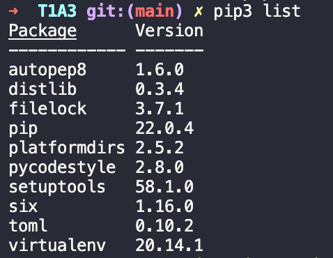

# MY WARDROBE Terminal App

MY WARDROBE is a terminal application that allows the user to enter in and store details about the items in their wardrobe so that they have a quick reference when they are shopping either online or in-store.

The user can enter new items, delete unwanted items, view their wardrobe and reset their wardrobe with this application.

Sizing varies so much across different brands. International sizes are different to Australia sizes.....When I shop for clothing or footwear online, I always find I have to run to my wardrobe and find an item of clothing from that particular brand so I can then go back to my order and select the correct size. The purpose of MY WARDROBE is to store that information for me in a json file so I have reference to is there and then, saving me time looking for it in my physical wardrobe.

# Repository:

https://Github.com/MichelleOha/terminal_app

# Implementation plan:

**Classes:**

A diagram of the classes that will be required for the application to work. These include:

1. Main class: runs the application.
2. InputOut class: includes the welcome_menu output for users selection and input. Also contains functions that define the input/output required for the app to work.
3. ReadWrite class: reads and writes to the json file.
4. Color class: used for text color in the application.

**Flowchart for MY WARDROBE:**

**PIP3 Installed packages:**

**Trello:**

**Checklist Example:**

**Code style guide used** PEP8 which is one of the packages installed.

# Features

**Welcome_menu**

- This features allows the user to make a selection from the options displayed in the welcome menu to navigate what function they would like to perform. Strings are colored for visual appeal.

**Storing of Data**

- The ReadWrite class has the responsibility of the persistance of data. In other words, the user reads and writes their items in the "wardrobe" which is the json file. As soon as the application runs, it reads the list.json file and checks for any data stored in there as a list. The json file allows us to store our wardrobe items, quit the application and reopen it and the data will still exist.

**Adding items**

- Option "1" in the welcome menu allows the user to add items to their wardrobe in this application. The user is asked six questions, one at a time so they can enter their input. This is then saved to their wardrobe (list.json).

**Removing items**

- Option "2" in the welcome menu allows the user to remove items from their wardrobe in this application. The user is asked which item they would like to remove by title and the application then deletes it from the wardrobe (json file).

**View Wardrobe**

- Option "3" allows the user to view there wardrobe. If there is any items in the wardrobe, the items will be displayed. If not, the welcome menu will be displayed.

**Reset Wardrobe**

- Option "4" allows the user to reset their wardrobe by deleting all existing items in the json file. They are asked if they are sure they want to reset the wardrobe. If Y, then the wardrobe is deleted. If N, the wardrobe is not cleared and remains as is. The string has been coloured in red and is bold to indicate a warning message before proceeding.

# Testing Template

On the first tab of my google excel spreadsheet I have added what feature I will be testing and allocated it with an ID:

On the second tab of my spreadsheet I have entered the information regarding the testing performed on this feature:

# Steps on how to install MY WARDROBE

## Install Python3

You will need python version 3.10 to run this application. To see if you have this version run the following command in your terminal:

`python3 -version`

If you don't have this version please update it or if you need to install python3, please visit:

For a Mac https://wsvincent.com/install-python/#install-python-on-macos
For WSL https://wsvincent.com/install-python/#install-python-on-linux

and follow the instructions to install the latest version of python3.

## Install pip

Copy and paste the below command to check if you have pip installed and what version of it:

`pip --version`

If pip is not installed, copy and paste this command:

`$ python -m ensurepip --upgrade`

## Install VirtualEnv

To check if you have VirtualEnv, copy and paste this command:

`virtualenv --version`

If not, copy and paste this command:

`python3 -m pip install virtualenv`

## NOW Let's Install MY WARDROBE Application:

To run this application on your local machine:

1. Clone repository

Copy and past this in your terminal:

`git clone git@github.com:MichelleOha/terminal_app.git`

2. Change into the following directory

`cd T1A3/src`

3. Run the following command to open the application in your terminal:

`./mywardrobe.sh`

**_ENJOY!_**

## Dependencies required to run MY WARDROBE:

# Reference list:

1. bauripalash (2019). How to write a simple toy database in Python within minutes. [online] freeCodeCamp.org. Available at: https://www.freecodecamp.org/news/how-to-write-a-simple-toy-database-in-python-within-minutes-51ff49f47f1/ [Accessed 13 Jul. 2022].

2. eeksforgeeks (2019). Read JSON file using Python. [online] GeeksforGeeks. Available at: https://www.geeksforgeeks.org/read-json-file-using-python/ [Accessed 11 Jul. 2022].

3. Netguru S.A. (2022). Dependency Injection With Python, Make It Easy! [online] www.netguru.com. Available at: https://www.netguru.com/blog/dependency-injection-with-python-make-it-easy [Accessed 16 Jul. 2022].

4. Python Software Foundation (2019). Built-in Types — Python 3.8.1rc1 documentation. [online] Python.org. Available at: https://docs.python.org/3/library/stdtypes.html [Accessed 14 Jul. 2022].

5. Python Software Foundation (2022). 9. Classes — Python 3.8.4rc1 documentation. [online] docs.python.org. Available at: https://docs.python.org/3/tutorial/classes.html [Accessed 9 Jul. 2022].

6. Roman Mogylatov. (2021). Dependency injection and inversion of control in Python — Dependency Injector 4.39.1 documentation. [online] python-dependency-injector.ets-labs.org. Available at: https://python-dependency-injector.ets-labs.org/introduction/di_in_python.html [Accessed 11 Jul. 2022].

7. Tutorials Point (2022). Python Standard Exceptions. [online] www.tutorialspoint.com. Available at: https://www.tutorialspoint.com/python/standard_exceptions.htm [Accessed 14 Jul. 2022].

8. w3schools (2022). Python Try Except. [online] www.w3schools.com. Available at: https://www.w3schools.com/python/python_try_except.asp [Accessed 14 Jul. 2022].
